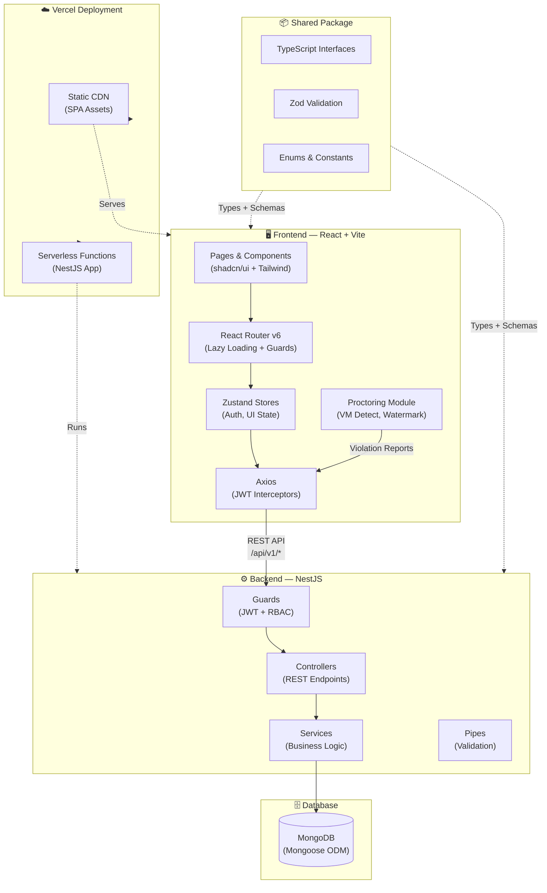
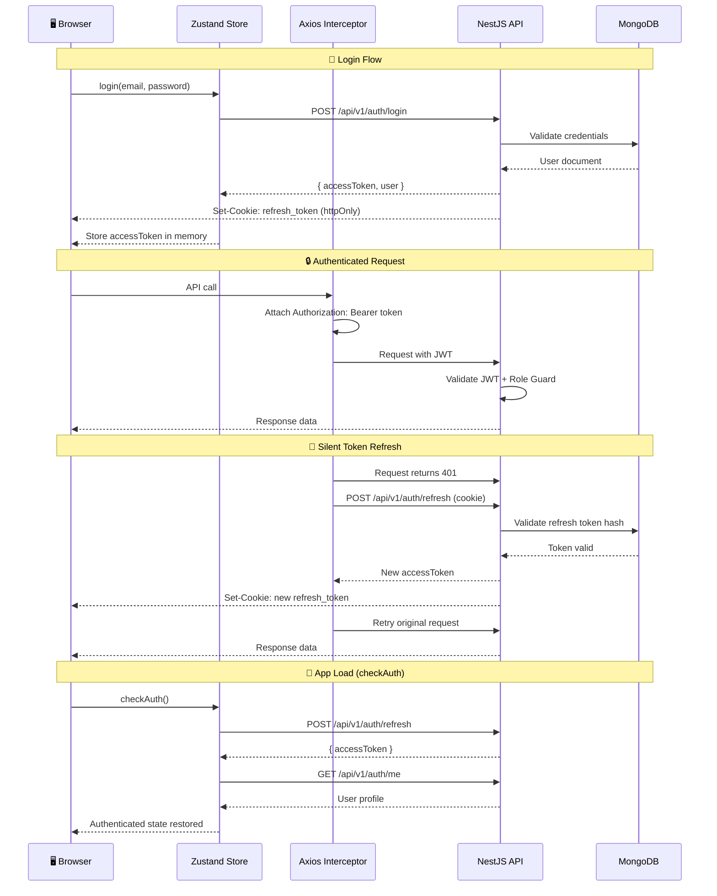
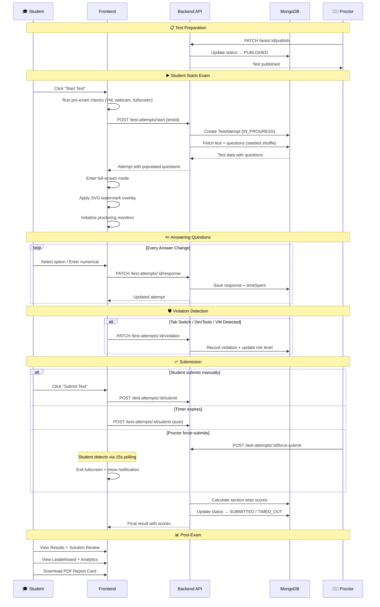
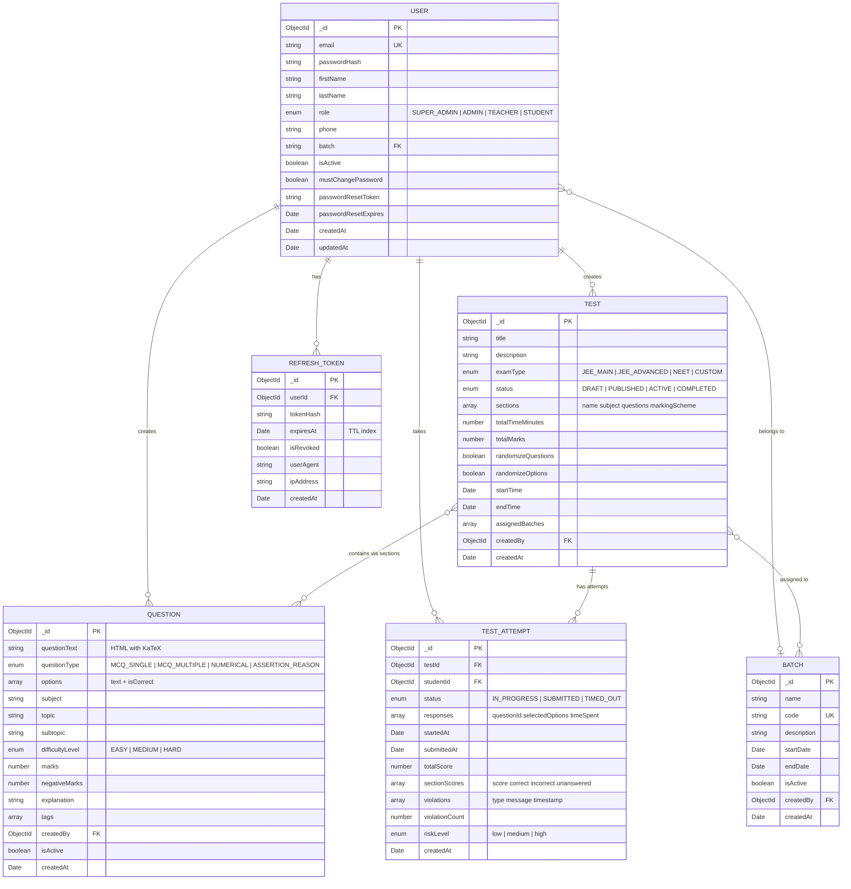

<div align="center">

# 🎓 Exam Portal

### Computer-Based Testing Platform for JEE/NEET Exam Preparation

[](https://www.typescriptlang.org/)
[](https://react.dev/)
[](https://nestjs.com/)
[](https://www.mongodb.com/)
[](https://turbo.build/)
[](https://vercel.com/)
[](LICENSE)
[](../../pulls)

A production-grade, full-stack exam management platform built for coaching centers and schools preparing students for competitive entrance exams (**JEE Main**, **JEE Advanced**, **NEET**). Supports 50–200 concurrent students with real-time proctoring, analytics, and role-based access control.

[Report Bug](../../issues) · [Request Feature](../../issues)

</div>

---

## 📑 Table of Contents

- [Features](#-features)
- [Tech Stack](#-tech-stack)
- [Architecture](#-architecture)
- [Project Structure](#-project-structure)
- [Database Schema](#-database-schema)
- [API Endpoints](#-api-endpoints)
- [Getting Started](#-getting-started)
- [Screenshots](#-screenshots)
- [User Roles & Permissions](#-user-roles--permissions)
- [Contributing](#-contributing)
- [License](#-license)

---

## ✨ Features

### 🔐 Authentication & Authorization
- JWT access tokens (in-memory) + refresh tokens (httpOnly cookies)
- Silent token refresh on app load and before expiry
- Role-based route guards with 4-tier role hierarchy
- Forced password change on first login
- Forgot / reset password flow
- Rate-limited login (5 attempts/min) and password reset (3/5min)

### 📝 Question Bank Management
- Rich HTML questions with **KaTeX** math rendering
- 4 question types: MCQ Single, MCQ Multiple, Numerical, Assertion-Reason
- Subject / topic / subtopic taxonomy (Physics, Chemistry, Math, Botany, Zoology)
- 3-tier difficulty levels (Easy, Medium, Hard)
- Bulk import via JSON
- Full-text search across question text and options
- Tag-based organization

### 📋 Test Builder
- **JEE Main**, **JEE Advanced**, **NEET** preset configurations
- Custom exam creation with flexible sections
- Per-section marking schemes (correct, incorrect, unanswered, partial)
- Auto-pick questions by subject, topic, and difficulty
- Question and option randomization (seed-based deterministic)
- Batch assignment for targeted test delivery
- Draft → Published → Active → Completed lifecycle

### ⏱️ Real-Time Exam Engine
- Full-screen exam interface with zero distractions
- Section-based navigation with **NTA 5-color** question palette
- Per-question timer tracking (time-spent analytics)
- Auto-save responses on every action
- Mark for review with answered + marked combo state
- Numerical answer input for integer-type questions
- Auto-submit on timer expiry

### 🛡️ Anti-Malpractice & Proctoring
- **VM / Remote Desktop detection** (WebGL GPU fingerprinting, CPU cores, device memory, battery API)
- **DevTools open detection**
- **Print Screen overlay** protection
- **SVG watermark** with student name, roll number, and session hash
- Tab switch and focus loss violation tracking
- Violation severity scoring (low / medium / high risk levels)
- **Force-submit** capability for proctors
- 15-second polling sync for force-submit detection on student side

### 📊 Results & Analytics
- Instant scoring with section-wise breakdown
- Score, correct / incorrect / unanswered per section
- Student performance analytics (multi-test trends)
- Leaderboard with rankings per test
- Solution review with correct answers and explanations
- **PDF report card** generation
- Admin analytics dashboard with test-level insights

### 👥 User & Batch Management
- CRUD for users with role assignment
- Bulk import of students
- Batch-based student grouping with codes
- Toggle active / inactive status (users and batches)
- Bulk status update and bulk delete operations

### 🖥️ Live Proctor Dashboard
- Real-time view of all active attempts for a test
- Student status monitoring (in-progress, submitted, timed-out)
- Violation count and risk level display
- Force-submit individual student attempts

---

## 🛠️ Tech Stack

### Frontend

| Technology | Version | Purpose |
|:---|:---:|:---|
| React | 18.3 | UI library with component architecture |
| Vite | 5.4 | Build tool with HMR |
| TypeScript | 5.4+ | Static type checking |
| Tailwind CSS | 3.4 | Utility-first CSS framework |
| shadcn/ui (Radix) | Latest | Accessible, composable UI primitives |
| React Router | v6 | Client-side routing with lazy loading |
| Zustand | 4.5 | Lightweight state management |
| TanStack Query | v5 | Server state management & caching |
| Axios | 1.6 | HTTP client with JWT interceptors |
| React Hook Form | 7.50 | Performant form handling |
| Zod | 3.23 | Schema validation (shared with backend) |
| Recharts | 2.15 | Charting and data visualization |
| KaTeX | 0.16 | LaTeX math rendering |
| Lucide React | 0.344 | Icon library |
| Sonner | 1.4 | Toast notifications |

### Backend

| Technology | Version | Purpose |
|:---|:---:|:---|
| NestJS | 10.3 | Progressive Node.js framework |
| Mongoose | 8.x | MongoDB ODM with schema validation |
| Passport + JWT | 10.0 | Authentication strategies |
| bcrypt | 5.1 | Password hashing |
| class-validator | 0.14 | DTO validation with decorators |
| class-transformer | 0.5 | Object transformation |
| Helmet | 7.1 | HTTP security headers |
| Throttler | 5.1 | Rate limiting |
| cookie-parser | 1.4 | HTTP cookie parsing |

### Shared Package

| Technology | Version | Purpose |
|:---|:---:|:---|
| Zod | 3.23 | Validation schemas shared across stack |
| tsup | 8.0 | TypeScript bundler (CJS + ESM + DTS) |

### DevOps & Tooling

| Technology | Purpose |
|:---|:---|
| Turborepo 2.4 | Monorepo build orchestration |
| Vercel | Deployment with serverless functions |
| Prettier 3.2 | Code formatting |
| GitHub Actions | CI/CD pipeline |

---

## 🏗️ Architecture

### System Overview



### Authentication Flow



### Exam Lifecycle Flow



---

## 📁 Project Structure

```
exam-portal/
├── .github/
│   └── workflows/              # GitHub Actions CI pipeline
├── api/
│   └── index.ts                # Vercel serverless entry point
├── packages/
│   ├── backend/                # @exam-portal/backend (NestJS)
│   │   └── src/
│   │       ├── main.ts
│   │       ├── app.module.ts
│   │       ├── common/
│   │       │   ├── decorators/   # @Public, @CurrentUser, @Roles
│   │       │   ├── dto/          # Shared DTOs (pagination, etc.)
│   │       │   ├── filters/      # Global exception filters
│   │       │   ├── guards/       # JWT auth + RBAC guards
│   │       │   ├── interceptors/ # Response transformation
│   │       │   └── pipes/        # Validation pipes
│   │       ├── config/           # App configuration
│   │       ├── modules/
│   │       │   ├── auth/         # Login, refresh, password reset
│   │       │   │   ├── dto/
│   │       │   │   ├── guards/
│   │       │   │   ├── schemas/  # RefreshToken schema
│   │       │   │   └── strategies/  # JWT + refresh strategies
│   │       │   ├── users/        # User CRUD + bulk ops
│   │       │   ├── questions/    # Question bank CRUD
│   │       │   ├── tests/        # Test builder + publishing
│   │       │   ├── test-attempts/ # Exam engine + scoring
│   │       │   └── batches/      # Batch management
│   │       └── seeds/            # Database seeders
│   │
│   ├── frontend/               # @exam-portal/frontend (React + Vite)
│   │   └── src/
│   │       ├── main.tsx
│   │       ├── App.tsx
│   │       ├── components/
│   │       │   ├── ui/           # shadcn/ui primitives
│   │       │   ├── common/       # Shared components
│   │       │   │   ├── math-renderer.tsx
│   │       │   │   ├── pagination.tsx
│   │       │   │   ├── stat-card.tsx
│   │       │   │   └── empty-state.tsx
│   │       │   ├── layout/       # Admin/Student layouts
│   │       │   │   ├── admin-layout.tsx
│   │       │   │   ├── student-layout.tsx
│   │       │   │   ├── sidebar.tsx
│   │       │   │   └── topbar.tsx
│   │       │   └── auth/         # Auth form components
│   │       ├── pages/
│   │       │   ├── auth/         # Login, Register, Password Reset
│   │       │   ├── admin/        # Dashboard, Users, Questions,
│   │       │   │   │             # Tests, Batches, Results, Settings
│   │       │   │   ├── dashboard/
│   │       │   │   ├── users/
│   │       │   │   ├── questions/
│   │       │   │   ├── tests/    # Test list + builder + proctor
│   │       │   │   ├── batches/
│   │       │   │   ├── results/
│   │       │   │   └── settings/
│   │       │   ├── student/      # Dashboard, Tests, Exam Page,
│   │       │   │   │             # Results, Analytics, Profile
│   │       │   │   ├── dashboard/
│   │       │   │   ├── tests/    # Available tests + exam engine
│   │       │   │   └── results/  # Results, analytics, leaderboard
│   │       │   └── teacher/      # Teacher dashboard
│   │       ├── routes/           # React Router config + guards
│   │       ├── services/         # API service layer (per module)
│   │       ├── stores/           # Zustand stores (auth, UI)
│   │       ├── hooks/            # Custom hooks
│   │       └── lib/              # Utilities
│   │           ├── api.ts        # Axios instance + interceptors
│   │           ├── proctoring.ts # VM detect, DevTools, PrintScreen
│   │           ├── watermark.ts  # SVG exam watermark generator
│   │           └── utils.ts      # cn() and helpers
│   │
│   └── shared/                 # @exam-portal/shared
│       └── src/
│           ├── index.ts          # Barrel export
│           ├── types/            # Shared TS interfaces
│           │   ├── user.types.ts
│           │   ├── question.types.ts
│           │   ├── test.types.ts
│           │   ├── test-attempt.types.ts
│           │   ├── batch.types.ts
│           │   └── auth.types.ts
│           ├── constants/        # Enums & constants
│           │   ├── roles.ts      # UserRole + role hierarchy
│           │   └── api-routes.ts # Type-safe route constants
│           └── validation/       # Shared Zod schemas
│
├── package.json                # Root workspace config
├── turbo.json                  # Turborepo pipeline config
├── tsconfig.base.json          # Shared TypeScript config
├── vercel.json                 # Vercel deployment config
└── .prettierrc                 # Prettier config
```

---

## 🗄️ Database Schema



---

## 🔌 API Endpoints

All endpoints are prefixed with `/api/v1/`.

### Authentication

| Method | Endpoint | Access | Description |
|:---:|:---|:---|:---|
| `POST` | `/auth/login` | Public | Login with email & password |
| `POST` | `/auth/logout` | Authenticated | Logout and revoke refresh token |
| `POST` | `/auth/refresh` | Cookie | Refresh access token |
| `GET` | `/auth/me` | Authenticated | Get current user profile |
| `POST` | `/auth/forgot-password` | Public | Request password reset email |
| `POST` | `/auth/reset-password` | Public | Reset password with token |
| `POST` | `/auth/change-password` | Authenticated | Change current password |

### Users

| Method | Endpoint | Access | Description |
|:---:|:---|:---|:---|
| `POST` | `/users` | Admin+ | Create a new user |
| `GET` | `/users` | Teacher+ | List users with filters & pagination |
| `GET` | `/users/stats` | Admin+ | Get user statistics |
| `GET` | `/users/:id` | Teacher+ | Get user by ID |
| `PATCH` | `/users/:id` | Admin+ | Update user |
| `DELETE` | `/users/:id` | Admin+ | Delete user |
| `POST` | `/users/bulk-import` | Admin+ | Bulk import users from JSON |
| `PATCH` | `/users/bulk-status` | Admin+ | Bulk toggle active status |
| `DELETE` | `/users/bulk-delete` | Admin+ | Bulk delete users |

### Questions

| Method | Endpoint | Access | Description |
|:---:|:---|:---|:---|
| `POST` | `/questions` | Teacher+ | Create question |
| `GET` | `/questions` | Teacher+ | List questions with filters |
| `GET` | `/questions/stats` | Teacher+ | Get question bank statistics |
| `GET` | `/questions/:id` | Teacher+ | Get question by ID |
| `PATCH` | `/questions/:id` | Teacher+ | Update question |
| `DELETE` | `/questions/:id` | Admin+ | Delete question |
| `POST` | `/questions/bulk-import` | Teacher+ | Bulk import questions |

### Tests

| Method | Endpoint | Access | Description |
|:---:|:---|:---|:---|
| `POST` | `/tests` | Teacher+ | Create test |
| `GET` | `/tests` | Teacher+ | List tests with filters |
| `GET` | `/tests/:id` | Teacher+ | Get test by ID |
| `PATCH` | `/tests/:id` | Teacher+ | Update test |
| `DELETE` | `/tests/:id` | Admin+ | Delete test |
| `PATCH` | `/tests/:id/publish` | Teacher+ | Publish a draft test |
| `PATCH` | `/tests/:id/sections/:idx/questions` | Teacher+ | Update section questions |
| `POST` | `/tests/:id/sections/:idx/auto-pick` | Teacher+ | Auto-pick questions for section |

### Test Attempts (Exam Engine)

| Method | Endpoint | Access | Description |
|:---:|:---|:---|:---|
| `GET` | `/test-attempts/available-tests` | Student | Get available tests |
| `GET` | `/test-attempts/my-attempts` | Student | Get attempt history |
| `POST` | `/test-attempts/start` | Student | Start a test attempt |
| `GET` | `/test-attempts/:id` | Student | Get attempt details |
| `PATCH` | `/test-attempts/:id/response` | Student | Save answer for a question |
| `PATCH` | `/test-attempts/:id/navigate` | Student | Update navigation state |
| `POST` | `/test-attempts/:id/submit` | Student | Submit test attempt |
| `PATCH` | `/test-attempts/:id/violation` | Student | Record proctoring violation |
| `GET` | `/test-attempts/:id/result` | Student | Get attempt result |
| `GET` | `/test-attempts/student-analytics` | Student | Get performance analytics |
| `GET` | `/test-attempts/student-rankings` | Student | Get student rankings |
| `GET` | `/test-attempts/results/test/:testId` | Teacher+ | Get all results for a test |
| `GET` | `/test-attempts/analytics/test/:testId` | Teacher+ | Get test analytics |
| `GET` | `/test-attempts/leaderboard/test/:testId` | All Auth | Get test leaderboard |
| `GET` | `/test-attempts/live-status/test/:testId` | Teacher+ | Live proctor dashboard data |
| `POST` | `/test-attempts/:id/force-submit` | Teacher+ | Force-submit a student attempt |

### Batches

| Method | Endpoint | Access | Description |
|:---:|:---|:---|:---|
| `POST` | `/batches` | Admin+ | Create batch |
| `GET` | `/batches` | Teacher+ | List batches with filters |
| `GET` | `/batches/codes` | Teacher+ | Get all batch codes |
| `GET` | `/batches/:id` | Teacher+ | Get batch by ID |
| `PATCH` | `/batches/:id` | Admin+ | Update batch |
| `DELETE` | `/batches/:id` | Admin+ | Delete batch |
| `PATCH` | `/batches/bulk-status` | Admin+ | Bulk toggle batch status |
| `DELETE` | `/batches/bulk-delete` | Admin+ | Bulk delete batches |

---

## 🚀 Getting Started

### Prerequisites

- **Node.js** >= 18.x
- **npm** >= 9.x
- **MongoDB** >= 6.x (local or [MongoDB Atlas](https://www.mongodb.com/atlas))
- **Git**

### Installation

```bash
# Clone the repository
git clone https://github.com/<your-username>/exam-portal.git
cd exam-portal

# Install all workspace dependencies
npm install

# Build the shared package first
npm run build --workspace=packages/shared
```

### Environment Variables

Create a `.env` file in the project root:

```env
# MongoDB
MONGODB_URI=mongodb://localhost:27017/exam-portal

# JWT Secrets (change in production!)
JWT_ACCESS_SECRET=your-access-secret-change-in-production
JWT_REFRESH_SECRET=your-refresh-secret-change-in-production
JWT_ACCESS_EXPIRY=15m
JWT_REFRESH_EXPIRY=7d

# Server
PORT=3000
FRONTEND_URL=http://localhost:5173
```

### Running the Application

```bash
# Development mode (starts both frontend & backend)
npm run dev

# Or run individually:
npm run dev --workspace=packages/backend    # Backend → http://localhost:3000
npm run dev --workspace=packages/frontend   # Frontend → http://localhost:5173
```

### Database Seeding

```bash
# Seed with sample users and questions
npm run seed
```

### Building for Production

```bash
# Build all packages
npm run build
```

### Default Credentials (after seeding)

| Role | Email | Password |
|:---|:---|:---|
| Admin | `admin@examportal.com` | `Admin@123` |
| Teacher | `teacher@examportal.com` | `Teacher@123` |
| Student | `student1@examportal.com` | `Student@123` |

> ⚠️ All seeded users have `mustChangePassword: false` for development convenience. In production, set this to `true`.

---

## 📸 Screenshots

<details>
<summary><b>Click to expand screenshots</b></summary>

### Admin Dashboard
> *Screenshot placeholder — admin dashboard with stats cards and activity feed*

### Question Bank
> *Screenshot placeholder — question list with math rendering and filters*

### Test Builder
> *Screenshot placeholder — section management with question picker*

### Student Exam Page
> *Screenshot placeholder — full-screen exam with question palette and timer*

### Live Proctor Dashboard
> *Screenshot placeholder — real-time monitoring of active exam sessions*

### Results & Analytics
> *Screenshot placeholder — score breakdown with charts and leaderboard*

</details>

---

## 👤 User Roles & Permissions

| Permission | Super Admin | Admin | Teacher | Student |
|:---|:---:|:---:|:---:|:---:|
| **User Management** | | | | |
| Create / edit / delete users | ✅ | ✅ | ❌ | ❌ |
| View user list | ✅ | ✅ | ✅ | ❌ |
| Bulk import users | ✅ | ✅ | ❌ | ❌ |
| **Question Bank** | | | | |
| Create / edit questions | ✅ | ✅ | ✅ | ❌ |
| Delete questions | ✅ | ✅ | ❌ | ❌ |
| View question bank | ✅ | ✅ | ✅ | ❌ |
| Bulk import questions | ✅ | ✅ | ✅ | ❌ |
| **Test Management** | | | | |
| Create / edit tests | ✅ | ✅ | ✅ | ❌ |
| Delete tests | ✅ | ✅ | ❌ | ❌ |
| Publish tests | ✅ | ✅ | ✅ | ❌ |
| **Exam Engine** | | | | |
| Take tests | ❌ | ❌ | ❌ | ✅ |
| View available tests | ❌ | ❌ | ❌ | ✅ |
| **Proctoring** | | | | |
| View live dashboard | ✅ | ✅ | ✅ | ❌ |
| Force-submit attempts | ✅ | ✅ | ✅ | ❌ |
| **Results & Analytics** | | | | |
| View all test results | ✅ | ✅ | ✅ | ❌ |
| View own results | ❌ | ❌ | ❌ | ✅ |
| View leaderboard | ✅ | ✅ | ✅ | ✅ |
| **Batch Management** | | | | |
| Create / edit / delete batches | ✅ | ✅ | ❌ | ❌ |
| View batches | ✅ | ✅ | ✅ | ❌ |

> **Role Hierarchy:** `SUPER_ADMIN (4) > ADMIN (3) > TEACHER (2) > STUDENT (1)`

---

## 🤝 Contributing

Contributions are welcome! Please follow these steps:

1. **Fork** the repository
2. **Create** a feature branch: `git checkout -b feature/amazing-feature`
3. **Commit** your changes: `git commit -m 'feat: add amazing feature'`
4. **Push** to the branch: `git push origin feature/amazing-feature`
5. **Open** a Pull Request

### Development Guidelines

- Follow the existing code style (Prettier formatting is enforced)
- Write TypeScript with strict mode enabled
- Use the shared package for types and validation schemas
- Place new API modules in `packages/backend/src/modules/`
- Place new pages in `packages/frontend/src/pages/`
- Use shadcn/ui primitives for UI components
- All API routes should have proper RBAC guards

### Commit Convention

This project follows [Conventional Commits](https://www.conventionalcommits.org/):

| Prefix | Purpose |
|:---|:---|
| `feat:` | New features |
| `fix:` | Bug fixes |
| `docs:` | Documentation changes |
| `refactor:` | Code refactoring |
| `test:` | Test changes |
| `chore:` | Build/tooling changes |

---

## 📄 License

This project is licensed under the **MIT License** — see the [LICENSE](LICENSE) file for details.

---

<div align="center">

**Built with ❤️ for educators and students**

[⬆ Back to Top](#-exam-portal)

</div>
